# Aide à la décision

+ [Introduction](#introduction)
+ [Modèle](#mod-le)
  - [Actions](#actions)
  - [Données](#donn-es)
  - [Coûts](#co-ts)
  - [Contributions](#contributions)
  - [Ordre lexicographique](#ordre-lexicographique)
+ [Formulation du problème](#formulation-du-probl-me)
  - [Formulation pour résolution avec le simplex](#formulation-pour-r-solution-avec-le-simplex)
  - [Formulation pour résolution avec une recherche exhaustive (récursive)](#formulation-pour-r-solution-avec-une-recherche-exhaustive--r-cursive-)

### Introduction
Ce projet s'inscrit dans le cadre d'un processus d'aide à la décision complexe, visant à résoudre un problème multidimensionnel de sélection d'actions. Pour cela, nous utilisons des concepts mathématiques et des modèles formels pour guider nos choix. L'objectif principal est d'optimiser les critères d'attractivité, de risque d'inondation et d'environnement, tout en respectant une contrainte budgétaire. À travers une représentation matricielle des actions, des données des critères et des coûts, ainsi que des contributions définies, on souhaite trouver la combinaison optimale d'actions. On propose d'abord une formalisation dans le but de mettre en place une résolution à l'aide du simplex, toutefois la résolution n'est faite pour l'instant qu'à travers une implémentation récursive qui s'apparente à une résolution type problème du sac à dos.

### Modèle

#### Actions

On représente les actions par une matrice $(A_{i,j})_{1\leq i\leq 14, 1 \leq j \leq 3}$ telle que :

$$\begin{cases*}
A_{i,j} = 1 \text{ si la variante $j$ de l'action $i$ est sélectionnée}\\
A_{i,j} = 0 \text{ sinon}
\end{cases*}$$

On a donc $A\in\mathcal{M}_{14,3}(\{0,1\})$ et

$$\forall 1 \leq i \leq 14 \quad A_{i, 1} + A_{i, 2} + A_{i, 3} \in \{0,1\}$$
i.e. on ne peut pas sélectionner plusieurs variantes d'une même action.

#### Données

On représente les données des critères et des aléas par un tenseur d'ordre 4 $(D_{i,j,k_\alpha})_{1 \leq i \leq 14, 1 \leq j \leq 3, 1 \leq k \leq 3, 1 \leq \alpha \leq 3}$ tel que :

$D_{i,j,k_\alpha} \in \mathbb{R}$ représente la valeur du critère $k$ au niveau d'aléa $\alpha$ pour la variante $j$ de l'action $i$

En l'occurrence ici, on a 3 critères et 4 niveau d'aléa :

-   $k = 1$ : attractivité
-   $k = 2$ : risque d'inondation
-   $k = 3$ : environnement

#### Coûts

On représente les coûts par une matrice $(C_{i, j})_{1 \leq i \leq 14, 1 \leq j \leq 3}$ telle que :

$C_{i,j} \in \mathbb{R}_+$ représente le coût de la variante $j$ de l'action $i$.

Si $A$ est une matrice d'actions, le coût $C_i$ de l'action $i$ est donné par

$$C_i = \sum_{j = 1}^{3} A_{i,j} C_{i,j}$$

Le coût total est donc donné par :

$$C_\text{total}(A) = \langle A, C \rangle$$

> Remarque: on utilise le produit scalaire matriciel canonique, i.e.
> $$\langle A, C \rangle = \text{tr}(A^T \cdot C) = \sum_{i = 1}^{14} \sum_{j = 1}^{3} A_{i,j} C_{i,j}$$

#### Contributions

Soit $A$ une matrice d'actions (i.e. $A$ a bien les propriétés définies ci-dessus). On définit la contribution de $A$ pour le critère $k$ au niveau d'aléa $\alpha$ par :

$$\text{Contrib}_ {k_\alpha}(A, D) = \sum_{i=1}^{14} \sum_{j=1}^3 A_{i,j} D_{i,j,k_\alpha}$$

#### Ordre lexicographique

L'ordre lexicographique $<_ {lex}$ est défini de manière générale par :
$$\forall \vec{x} \forall \vec{y} \quad \vec{x} <_{lex} \vec{y} \equiv \exists k \forall i < k \quad x_i = y_i \land x_k < y_k$$

### Formulation du problème

#### Formulation pour résolution avec le simplex

On souhaite déterminer une famille d'actions à choisir de façon à maximiser les critères, et ce pour un coût inférieur à un certain seuil.

> La façon dont on souhaite maximiser les critères est la suivante :
>
> -   On commence par maximiser le premier critère (l'attractivité) ;
> -   Si deux actions ont la même attractivité, on maximise le deuxième critère (le risque d'inondation) ;
> -   Si deux actions ont la même attractivité et le même risque d'inondation, on maximise le troisième critère (l'environnement).
>
> On utilisera donc l'ordre lexigraphique $<_ {lex}$ sur les critères 1, 2 et 3 (dans cet ordre) pour comparer les actions.

Soit $\alpha$ un niveau d'aléa. Le problème se formule donc de la manière suivante.
On cherche une matrice d'actions $A$ telle que :

$$\begin{cases*}
(\text{Contrib}_ {k_\alpha}(A, D))_ {k \in \{1,2,3\}} = \underset{A'}{\max_ {lex}} \ (\text{Contrib}_ {k_\alpha}(A', D))_ {k \in \{1,2,3\}} \\
C_ {\text{tot}}(A) \leq C_\text{max}
\end{cases*}$$

> $\max_ {lex}$ est l'opérateur de maximisation pour l'ordre lexicographique.

Le fait que $A$ soit une matrice d'action ajoute les contraintes suivantes, pour tout $i \in \{1, \dots, 14\}$ :

$$
\begin{align*}
&A_{i, 1} + A_{i, 2} + A_{i, 3} &\leq 1\\
&-A_{i, 1} &\leq 0\\
&-A_{i, 2} &\leq 0\\
&-A_{i, 3} &\leq 0\\
\end{align*}
$$

#### Formulation pour résolution avec une recherche exhaustive (récursive)
Pas encore rédigé, cf le code dans [`main.py`](./main.py).

L'idée est de résoudre le problème comme le problème du sac à dos, en prenant en compte qu'une seule des trois variantes peut être choisie pour chaque action. On fait une recherche exhaustive en coupant les branche qui cassent la contrainte de coût et en faisant du backtracking sur l'optimisation des critères (maximisation selon l'ordre lexicographique).

L'arbre d'exécution peut être représenté comme suit (on ne représente que les deux premiers choix car l'arbre devient vite très très grand) :

```mermaid
graph TD
  R(( ))
  A11((A11))
  A12((A12))
  A13((A13))

  R --> A11
  R --> A12
  R --> A13

  A11 -->|Pris| A11_1(( ))
  A11 -->|Pas pris| A11_0(( ))
  A12 -->|Pris| A12_1(( ))
  A12 -->|Pas pris| A12_0(( ))
  A13 -->|Pris| A13_1(( ))
  A13 -->|Pas pris| A13_0(( ))

  A11_1 --> N1((A21))
  A11_1 --> N2((A22))
  A11_1 --> N3((A23))
  A11_0 --> N4((A21))
  A11_0 --> N5((A22))
  A11_0 --> N6((A23))
  A12_1 --> N7((A21))
  A12_1 --> N8((A22))
  A12_1 --> N9((A23))
  A12_0 --> N10((A21))
  A12_0 --> N11((A22))
  A12_0 --> N12((A23))
  A13_1 --> N13((A21))
  A13_1 --> N14((A22))
  A13_1 --> N15((A23))
  A13_0 --> N16((A21))
  A13_0 --> N17((A22))
  A13_0 --> N18((A23))

  N1 -->|Pris| N1_1(( ))
  N1 -->|Pas pris| N1_0(( ))
  N2 -->|Pris| N2_1(( ))
  N2 -->|Pas pris| N2_0(( ))
  N3 -->|Pris| N3_1(( ))
  N3 -->|Pas pris| N3_0(( ))
  N4 -->|Pris| N4_1(( ))
  N4 -->|Pas pris| N4_0(( ))
  N5 -->|Pris| N5_1(( ))
  N5 -->|Pas pris| N5_0(( ))
  N6 -->|Pris| N6_1(( ))
  N6 -->|Pas pris| N6_0(( ))
  N7 -->|Pris| N7_1(( ))
  N7 -->|Pas pris| N7_0(( ))
  N8 -->|Pris| N8_1(( ))
  N8 -->|Pas pris| N8_0(( ))
  N9 -->|Pris| N9_1(( ))
  N9 -->|Pas pris| N9_0(( ))
  N10 -->|Pris| N10_1(( ))
  N10 -->|Pas pris| N10_0(( ))
  N11 -->|Pris| N11_1(( ))
  N11 -->|Pas pris| N11_0(( ))
  N12 -->|Pris| N12_1(( ))
  N12 -->|Pas pris| N12_0(( ))
  N13 -->|Pris| N13_1(( ))
  N13 -->|Pas pris| N13_0(( ))
  N14 -->|Pris| N14_1(( ))
  N14 -->|Pas pris| N14_0(( ))
  N15 -->|Pris| N15_1(( ))
  N15 -->|Pas pris| N15_0(( ))
  N16 -->|Pris| N16_1(( ))
  N16 -->|Pas pris| N16_0(( ))
  N17 -->|Pris| N17_1(( ))
  N17 -->|Pas pris| N17_0(( ))
  N18 -->|Pris| N18_1(( ))
  N18 -->|Pas pris| N18_0(( ))
```

